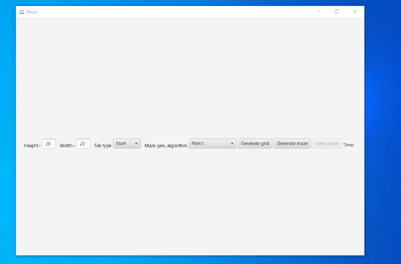

# MazeSolver
Maze generator and solver using A* algorithm

Features:
* You can draw a maze by yourself or let the program do it for you
* Then the program finds the shortest path to solve the maze
* Includes JMH benchmark

## Demo

20x20 Prim's Maze solver

100x100 Prim's Maze solver

100x100 Aldous-Broder Maze solver

20x20 Free draw Maze solver

